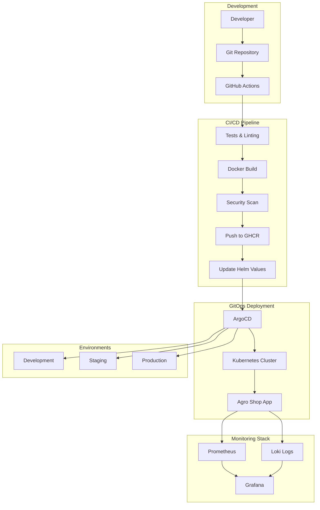

# Agro Shop - Complete DevOps Platform with GitOps

## 📌 Project Overview
Agro Shop is a modern e-commerce platform for agricultural products, built with Flask and deployed using complete DevOps practices. The project demonstrates enterprise-level CI/CD pipelines, GitOps workflows with ArgoCD, comprehensive monitoring, and cloud-native deployment strategies.

The platform showcases real-world DevOps implementation including automated testing, security scanning, multi-environment deployments, observability, and infrastructure as code.

---

# 🏗️ Complete System Architecture

## GitOps Workflow with ArgoCD



## Core Architecture Components

### 🚀 Application Layer
- **Flask Web Application** - E-commerce platform for agricultural products
- **REST API** - Complete CRUD operations for products, orders, and statistics
- **Admin Dashboard** - Product and order management interface
- **SQLite Database** - Persistent data storage with models

### 🔄 CI/CD Pipeline
- **GitHub Actions** - Automated build, test, and deployment
- **Multi-environment support** - Dev, Staging, Production workflows
- **Security scanning** - Trivy vulnerability assessment
- **Quality gates** - Automated testing and linting

### 🎯 GitOps with ArgoCD
- **Declarative deployments** - Infrastructure and applications as code
- **Multi-environment management** - Separate configs for each environment
- **Automated synchronization** - Git as single source of truth
- **Rollback capabilities** - Easy revert to previous versions


### 📊 Monitoring & Observability
- **Prometheus** - Metrics collection and alerting
- **Grafana** - Custom dashboards for business and technical metrics
- **Loki** - Centralized log aggregation
- **Custom metrics** - Business KPIs and application performance


---

# 🛠️ Technology Stack

## Backend & Application
- **Python 3.9+** - Core application runtime
- **Flask** - Web framework with Jinja2 templating
- **SQLAlchemy** - Database ORM and migrations
- **SQLite** - Lightweight database for development
- **Prometheus Client** - Custom metrics collection
- **Structured Logging** - JSON formatted logs for observability

## DevOps & Infrastructure
- **Docker** - Application containerization
- **Kubernetes** - Container orchestration
- **Helm** - Kubernetes package management
- **ArgoCD** - GitOps continuous deployment
- **GitHub Actions** - CI/CD automation
- **GitHub Container Registry** - Docker image storage


## Monitoring & Observability
- **Prometheus** - Metrics collection and alerting

- **Grafana** - Visualization and dashboards

- **Log**


## Security & Quality
- **Trivy** - Container vulnerability scanning
- **Flake8** - Python code linting
- **pytest** - Automated testing framework

```
Project Structure:
DevOPS/
├── app.py                      # Main Flask application
├── api/                        # REST API endpoints
│   └── api_routes.py          # Product, order, stats APIs
├── admin/                      # Admin dashboard
│   ├── admin_controller.py    # Admin routes
│   └── admin_products.py      # Product management
├── models/                     # Database models
│   ├── product.py             # Product model
│   └── order.py               # Order model
├── templates/                  # HTML templates
├── static/                     # CSS and static files
├── monitoring/                 # Observability stack
│   ├── metrics.py             # Custom Prometheus metrics
│   ├── prometheus.yml         # Prometheus configuration
│   ├── loki.yml               # Loki configuration
│   └── grafana/               # Grafana dashboards
├── helm/                       # Kubernetes Helm charts
│   └── agro-shop/             # Application Helm chart
├── argocd/                     # GitOps configurations
│   ├── application.yaml       # ArgoCD application
│   ├── applicationset.yaml    # Multi-environment setup
│   └── appproject.yaml        # ArgoCD project
├── deploy/                     # Deployment configurations
│   ├── k8s/                   # Kubernetes manifests
│   └── scripts/               # Deployment scripts
├── tests/                      # Test suites
│   └── integration_test.py    # API integration tests
├── .github/workflows/          # CI/CD pipelines
├── docker-compose.yml          # Local development stack
├── Dockerfile                  # Application container
└── requirements.txt            # Python dependencies
```

---

This Agro Shop platform demonstrates enterprise-grade DevOps practices with complete CI/CD, GitOps, Logs, monitoring, and observability. The architecture is scalable, secure, and follows cloud-native best practices.

For questions or support, please open an issue or contact the development team.
